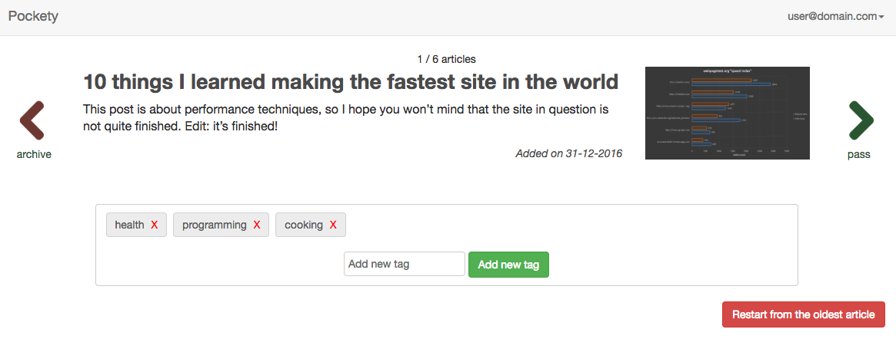

# Pockety

A small tool that will help you clean/sort your Pocket articles.

## Description

### Usual process

1. Pockety makes you login with your Pocket account
1. You then create a list of tags you will want to apply to your Pocket articles (you can change this at any time)
1. Pockety will then present you with each of the articles in your Pocket account, with buttons to either Archive, 
Keep (and do nothing) or Tag the article

### Screenshot



### Notes

- No information about your username/password/articles is ever stored in Pockety. We only store the Pocket API access
token (which gets deleted upon logout) and the timestamp of the last article you modified (so that we can query from
then on)

## Installation

```
git clone git@github.com:mateicarpen/pockety.git
cd pockety

composer install

cp .env.example .env
php artisan key:generate
# modify the .env file to suit your needs (you will need a Pocket consumer key and database details)

npm install # or yarn

php artisan migrate

gulp # or gulp --production
```

## Technologies used

- Laravel 5.3
- Vue.js 1.0
